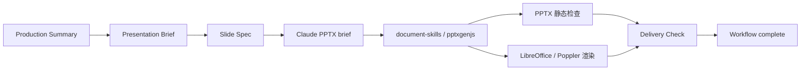
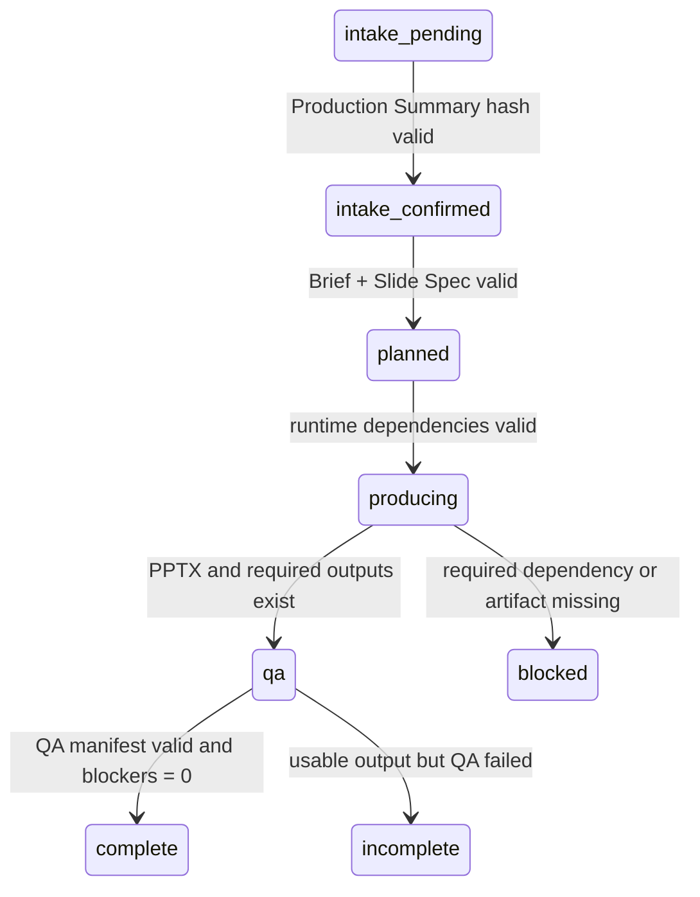

# PPT 生成质量保障审计报告

> 审计对象：`student-presentation-suite` Claude Code 插件  
> 审计分支：`claude-code`  
> 审计日期：2026-07-13  
> 审计方式：代码、schema、skill 契约、测试、发布校验和最小复现实验  
> 文档性质：问题审计与整改设计，不代表问题已经修复

## 1. 执行摘要

插件已经建立了较完整的学生演示工作流，包括 Production Summary、
Presentation Brief、Slide Spec、视觉风格菜单、静态 PPTX 检查、渲染要求和
delivery check。文档层面对文字密度、字号、场景、证据、视觉风格、图片来源和
修订流程的描述比较系统。

但当前实现的核心问题是：**规范描述强，机器门禁弱**。现有代码能够较可靠地
确认 PPTX、讲稿和预览文件是否存在，却不能可靠证明成品已经达到可展示的视觉
质量。特别是 `pptx_delivery_check.py --strict` 不会因文字溢出、对象越界、
低留白等 blocker-like 风险失败，preview 也只验证路径存在。状态机允许在没有
QA 证据的情况下从 `qa` 转为 `complete`。

因此，当前版本可以称为“具备质量流程和检查提示”，还不能称为“具备严格的
PPT 生成质量保障”。在修复高优先级门禁之前，不应把 `strict` 成功等同于
“布局安全、视觉完成、可直接上台”。

### 1.1 总体评级

| 维度 | 当前状态 | 结论 |
| --- | --- | --- |
| 内容结构 | 中等偏强 | 有 Slide Spec 和确定性内容分析，但场景必需章节未被完整验证 |
| 字号与文字密度 | 中等 | 有静态估算，但存在崩溃分支、误差和 strict 不阻断问题 |
| 线条感与图形语言 | 弱 | 主要依赖 prose 指令，没有 design tokens 和 connector 检查 |
| 空间布局 | 弱到中等 | 能发现部分越界和极端密度，但不检查全对象重叠、gutter 和网格 |
| 美观度与风格一致性 | 弱 | 有 14 套风格说明，但没有成品一致性验证 |
| 场景适配 | 中等偏弱 | 有场景分类文档，缺少场景到必需 story role 的强制映射 |
| 渲染 QA | 弱 | 文档要求较强，但工具和状态机没有形成可审计闭环 |
| 发布测试 | 中等 | 基础测试完整，但 smoke 不验证真实视觉质量 |

### 1.2 风险分布

| 等级 | 数量 | 含义 |
| --- | ---: | --- |
| P1 | 5 | 会直接破坏质量门禁、生产稳定性或场景正确性 |
| P2 | 4 | 会导致视觉质量不稳定、风格漂移或重要问题漏检 |
| P3 | 3 | 会增加误报、漏报或维护成本 |

## 2. 审计范围

本次审计覆盖以下链路：



重点文件包括：

- `references/presentation-intake.md`
- `references/presentation-brief.md` 及 schema
- `references/slide-spec.md` 及 schema
- `skills/student-presentation-ppt/SKILL.md`
- `skills/student-presentation-ppt/references/pptx-production.md`
- `skills/student-presentation-ppt/references/visual-style-menu.md`
- `skills/student-presentation-ppt/references/visual-styles/*.md`
- `scripts/slide_spec_to_pptx_brief.py`
- `shared/presentation_quality.py`
- `shared/pptx_static_core.py`
- `skills/student-presentation-ppt/scripts/pptx_delivery_check.py`
- `scripts/workflow_guard.py`
- `.github/workflows/validate.yml`
- `scripts/smoke_pptx.py`
- 相关单元测试和发布检查

本次没有评审某一份真实学生成品 PPT，也没有修改插件实现。结论针对插件的
质量保障机制本身。

## 3. 验证基线

审计时执行了以下检查：

```powershell
$env:PYTHONPATH=(Resolve-Path "plugins/student-presentation-suite").Path
python -m unittest discover -s plugins/student-presentation-suite/tests -v
python plugins/student-presentation-suite/scripts/smoke_pptx.py
python plugins/student-presentation-suite/scripts/check_plugin_release.py --json
python scripts/check_marketplace_release.py --json
git diff --check
```

结果：

- 82 个单元测试全部通过；
- PPTX smoke 通过；
- 插件 release check 通过；
- marketplace release check 通过；
- `git diff --check` 通过。

这些结果说明仓库的基础契约和发布结构稳定，但后续最小复现实验同时证明：
**当前测试全绿并不能代表 PPT 视觉质量门禁有效。**

## 4. P1 问题：必须优先修复

### 4.1 `--strict` 不会阻断静态布局高风险

涉及文件：

- `plugins/student-presentation-suite/skills/student-presentation-ppt/scripts/pptx_delivery_check.py`
- `plugins/student-presentation-suite/shared/pptx_static_core.py`

`summarize_static_risks()` 会识别以下 blocker-like 风险：

- `high-text-density-overflow-risk`
- `text-vertical-overflow-risk`
- `paragraph-heavy-slide-text`
- `heading-font-size-below-24pt`
- `shape-outside-slide`
- `low-whitespace-risk`

但是命令行入口的 strict 判断仅检查 `missing_expected_files`：

```python
if args.strict and result["missing_expected_files"]:
    raise SystemExit(2)
```

这导致检查结果可以同时满足：

```text
blocker_like_count = 1
process exit code = 0
```

#### 影响

- 明确的文字溢出仍可被标记为 delivery success；
- 对象越界或极端低留白不阻断交付；
- 自动化流程可能继续把状态改为 `complete`；
- `--strict` 名称会给调用者造成错误的安全预期。

#### 修复要求

delivery check 应生成统一的 `ok` 字段，至少满足：

```text
pptx_exists
AND pptx_readable
AND slide_count > 0
AND static_scan_error is null
AND blocker_like_count == 0
AND required_files_valid
AND render_qa_valid
```

`--strict` 应依据 `ok` 返回非零，而不是只检查文件缺失。

### 4.2 preview 只检查存在性，无法证明视觉 QA

涉及文件：

- `plugins/student-presentation-suite/skills/student-presentation-ppt/scripts/pptx_delivery_check.py`
- `plugins/student-presentation-suite/scripts/smoke_pptx.py`

当前 preview 检查只调用 `Path.is_file()`。没有验证：

- PNG/JPEG/PDF 是否可解码；
- 图片是否为空白或只有单色；
- 图片尺寸是否适合检查；
- contact sheet 是否覆盖全部页面；
- PDF 页数是否与 PPTX 页数一致；
- preview 是否由当前 PPTX 生成；
- preview 是否在最近一次修复后重新生成。

最小复现实验使用普通文本字节伪装 `.png`，检查仍然成功。现有 smoke test
还会生成一张纯白 640×360 图片作为 preview，因此 smoke 实际验证的是文件契约，
不是视觉质量。

#### 影响

- 空白预览、损坏图片、旧版本预览都可能通过；
- 无法证明完成过 rendered inspection；
- 无法证明全部页面被查看；
- 无法证明执行过文档要求的修复—复验循环。

#### 修复要求

引入 `qa-manifest.json`，建议至少包含：

```json
{
  "pptx_sha256": "...",
  "slide_count": 10,
  "rendered_page_count": 10,
  "preview_files": ["..."],
  "preview_sha256": ["..."],
  "rendered_at": "...",
  "visual_inspection": {
    "completed": true,
    "inspected_pages": [1, 2, 3, 4, 5, 6, 7, 8, 9, 10],
    "repair_cycles": 1,
    "remaining_blockers": 0
  }
}
```

delivery check 应验证 manifest 中的 PPTX hash、页数和文件 hash。

### 4.3 超长文本会导致 bridge 抛出 `KeyError`

涉及文件：

- `plugins/student-presentation-suite/scripts/slide_spec_to_pptx_brief.py`

文本适配预警写入：

```python
"fill_ratio_pct": round(overflow_fill * 100)
```

但输出时读取：

```python
w["fill_ratio"]
```

当内容足够长、真正触发 overflow warning 时，`build_brief()` 会抛出：

```text
KeyError: 'fill_ratio'
```

#### 影响

- 越需要文字适配保护的页面，越可能在 production brief 阶段直接失败；
- 正常短文本测试无法覆盖该分支；
- 用户可能在已经确认 Production Summary 后遇到生产中断。

#### 修复要求

- 统一字段名为 `fill_ratio_pct`；
- 增加超长中文、超长英文、双语、换行和 bullets 测试；
- 测试必须调用完整 `build_brief()`，不能只测试估算函数。

### 4.4 `complete` 状态没有绑定 QA 证据

涉及文件：

- `plugins/student-presentation-suite/scripts/workflow_guard.py`

当前状态转换只验证顺序：

```text
intake_pending → intake_confirmed → planned → producing → qa → complete
```

从 `qa` 转为 `complete` 时，不要求提供 delivery report、render report、
PPTX hash、preview 或 blocker 数量。因此状态机只能证明调用者执行了状态转换，
不能证明质量门禁通过。

另一个问题是 `unblock`：它把状态设为 `intake_confirmed`，同时清空
`summary_sha256`。hook 又仅根据状态放行生产命令，导致“要求重新确认”的提示与
实际行为不一致。

#### 修复要求

- `transition --to complete` 必须接收并验证 `--qa-manifest`；
- manifest 的 PPTX hash 必须与当前交付文件一致；
- `remaining_blockers` 必须为 0；
- `rendered_page_count` 必须与 PPTX 页数一致；
- `repair_cycles` 至少为 1，或明确记录豁免理由；
- `unblock` 应回到 `intake_pending`，或 hook 同时要求有效的
  `summary_sha256`；
- 不允许 hash 为空的 `intake_confirmed` 状态执行生产命令。

### 4.5 场景适配没有成为强制语义规则

涉及文件：

- `plugins/student-presentation-suite/references/slide-spec.schema.json`
- `plugins/student-presentation-suite/shared/slide_spec_validation.py`
- `plugins/student-presentation-suite/shared/presentation_quality.py`

当前 schema 支持 `coursework`、`defense`、`competition`、`club-showcase`、
`research`，但没有验证每种场景必须具备的 story role。

最小复现实验构造了 `high-score + defense` Slide Spec，只包含 opening、
limitation 和 conclusion，没有 method、result 或 contribution。结果是：

```text
schema errors = 0
analyzer ok = true
findings = []
```

#### 建议的最低场景契约

| 场景 | 必需 story role / 结构 |
| --- | --- |
| coursework | background/problem、analysis/method、evidence/result、conclusion |
| defense | problem/question、method、implementation/work、result、contribution、limitation、qa |
| competition | problem、solution、implementation、validation/result、value、feasibility/risk |
| club-showcase | purpose、activity/process、outcome、participant story、next action |
| research | question/problem、context、method、result、interpretation、limitation、conclusion |

不能只检查字段存在，还应检查顺序、最小覆盖和合理豁免。

## 5. P2 问题：视觉质量体系缺口

### 5.1 线条感没有可执行标准

视觉风格文件会使用“thin divider”“orthogonal connectors”“highlight
strokes”等描述，但没有统一的数值化 line system。

当前缺少：

- 线宽层级，例如 0.75pt / 1.5pt / 2.5pt / 4pt；
- divider、border、connector、emphasis line 的职责区分；
- arrowhead 尺寸与使用条件；
- 实线、虚线、点线的语义；
- line cap、join 和拐角规则；
- connector 锚点、端口间距和交叉处理；
- 同一页线条数量和视觉权重限制；
- 浅色背景、深色背景下的线条对比度阈值。

#### 后果

- 不同页面的线条粗细容易随机变化；
- 流程图箭头可能过粗、过细或互相穿越；
- 装饰线和信息线缺乏层级；
- 技术风格可能变成“细线很多但关系不清楚”；
- 人文风格可能出现无意义的标题下划线。

#### 建议的数据结构

```yaml
design_tokens:
  lines:
    hairline_pt: 0.75
    standard_pt: 1.25
    emphasis_pt: 2.5
    section_rule_pt: 4
    connector_style: orthogonal
    connector_color_role: secondary_text
    arrowhead: triangle-small
    dashed_semantics: optional-or-future
```

### 5.2 空间布局检查只覆盖部分文本框

`pptx_static_core.py` 当前主要遍历带文字的 shape 和部分 graphicFrame。
图片、无文字图形、背景层、connector 和部分 chart 内容不在统一几何模型中。

目前没有可靠检查：

- 任意两个可见对象的相交面积；
- 文字框与图片、图表、形状的遮挡；
- 最小 gutter 和 card padding；
- 标题区、内容区、页脚区是否侵占；
- 多列布局的列宽与间距一致性；
- 水平/垂直对齐误差；
- baseline rhythm；
- 图片裁切后的焦点位置；
- connector 是否穿过节点或文字。

`low-whitespace-risk` 通过累加文字框矩形面积估算。它会忽略图片和无文字形状，
重叠文本框又可能重复计算面积，因此只能作为弱提示。

#### 建议的空间 token

```yaml
design_tokens:
  geometry:
    slide_ratio: "16:9"
    safe_margin_pct: 6
    title_zone_pct: 16
    footer_zone_pct: 5
    spacing_scale_pt: [6, 12, 18, 24, 36, 48]
    min_gutter_pt: 18
    min_card_padding_pt: 16
    max_columns: 3
    alignment_tolerance_pt: 3
```

### 5.3 美观度和风格一致性主要依赖生成模型发挥

14 套视觉风格的内容覆盖了 palette、geometry、slide recipes、image
treatment 和 acceptance checks，这是良好的设计知识层。但它们仍是 Markdown
prose，production bridge 只传递 `visual_style` 名称，没有把选中风格编译成
结构化 design tokens。

当前也没有检查实际成品是否遵守：

- palette roles；
- 字体配对和字号层级；
- 圆角和阴影层级；
- 图片裁切比例；
- 同一 motif 的一致性；
- 连续页面布局重复限制；
- 数据颜色语义一致性；
- 深色封面与浅色内容页的节奏；
- 风格是否与学校模板冲突。

#### 修复方向

1. 为每个风格增加机器可读 YAML/JSON token；
2. 由 bridge 将选中风格的 token 展开到 production brief；
3. 生成后从 PPTX 提取颜色、字体、圆角、线宽和版式统计；
4. 输出 style adherence report；
5. 把严重偏离加入 delivery blocker。

### 5.4 `visual_text_ratio` 和 layout intent 没有语义验证

`visual_text_ratio` 当前只是枚举：`text-led`、`balanced`、`visual-led`。
系统不会检查 visual-led deck 是否真的有足够视觉结构。

`layout` 也是任意非空字符串。即使填写 `timeline`、`process` 或
`comparison`，也不要求 Slide Spec 提供对应节点、顺序、对象或差异维度。

#### 建议

为常见 layout 增加结构化 details：

```yaml
visual:
  type: timeline
  purpose: 展示项目从调研到验证的推进过程
  details:
    orientation: horizontal
    stages:
      - label: 调研
        status: complete
      - label: 原型
        status: complete
      - label: 测试
        status: current
```

语义验证应检查：

- timeline 至少有 3 个有序阶段；
- comparison 至少有 2 个对象和明确比较维度；
- process 至少有 2 个步骤或一个反馈环；
- chart 必须有 measure、unit、scope、source、takeaway；
- visual-led 内容页不能全部缺少 visual；
- text-only 模式下不得强制 visual。

## 6. P3 问题：准确性和维护性

### 6.1 文字溢出估算忽略真实排版因素

当前估算主要使用字符数、统一平均字宽、文本框宽高和固定行高。它没有完整考虑：

- 显式换行；
- bullet indent；
- 文本框内部 margin；
- 粗体、斜体和不同字体宽度；
- 英文长单词不可任意断行；
- CJK 与 Latin 混排；
- 段前段后距；
- autofit、vertical anchor 和 PowerPoint/WPS 差异。

建议保留当前估算作为预警，同时在渲染后加入像素或 Office 输出层面的检测，
不要把字符估算作为最终真值。

### 6.2 overflow 阈值使用舍入值判断

`estimate_text_overflow()` 同时返回 `fill_ratio` 和 `fill_ratio_raw`，但调用者使用
舍入后的 `fill_ratio` 与 0.85 比较。靠近阈值时可能出现边界漏报。应使用
`fill_ratio_raw` 判断，舍入值只用于显示。

### 6.3 现有契约测试偏重“字符串存在”

部分测试验证文档中存在某个字段、状态文字或风格名称，但不验证行为。例如：

- 14 个 style 文件存在，不代表 token 被 production brief 使用；
- schema 中存在 scenario，不代表场景必需结构被执行；
- 文档中写有 fix-and-verify，不代表状态机要求提供修复证据；
- smoke 中有 preview 文件，不代表 preview 来自真实渲染。

建议将关键契约测试改为输入—输出行为测试和失败路径测试。

## 7. 建议的目标质量架构

### 7.1 规划层

Presentation Brief 应负责全局控制：

- 场景、受众、时长、语言；
- rubric 和质量等级；
- 视觉风格、图片策略；
- design tokens；
- 交付格式和版本策略。

Slide Spec 应负责逐页意图：

- story role；
- claim 和 evidence；
- layout intent；
- visual details；
- hierarchy 和 focal point；
- speaker notes；
- lock 和 revision scope。

### 7.2 生产层

bridge 不应只输出风格名称，而应输出已解析的生产控制：

```text
selected style
→ resolved palette
→ geometry tokens
→ line system
→ typography scale
→ slide-type recipes
→ image treatment
→ per-slide layout intent
```

生成脚本应使用共享 helper，统一处理：

- slide safe area；
- title/body/footer zones；
- text fitting；
- image crop；
- connector；
- color roles；
- source caption；
- slide numbering。

### 7.3 QA 层

建议拆成四类报告：

1. `content-quality-report.json`
   - 场景结构、证据、密度、重复、AI 套话、时长。
2. `pptx-static-report.json`
   - 字号、越界、重叠、网格、线条、图片、图表和兼容性。
3. `render-qa-report.json`
   - 渲染页数、空白页、尺寸、页面覆盖和视觉检查记录。
4. `delivery-report.json`
   - 汇总前三者、文件 hash、最终 blocker 和交付状态。

### 7.4 状态层

状态应由证据驱动：



## 8. 分阶段整改计划

### 阶段 A：修复门禁真实性

目标：确保 strict 成功至少意味着“没有已知 blocker，且渲染证据完整”。

- 修复 `fill_ratio_pct` KeyError；
- delivery check 增加 `ok` 和明确 exit code；
- 静态扫描错误必须阻断 strict；
- blocker-like 风险必须阻断 strict；
- preview 必须可解码；
- PDF/contact sheet 页数必须覆盖全部 slide；
- 增加 QA manifest；
- `complete` 必须验证 QA manifest；
- 修复 unblock/summary hash 漏洞；
- 增加失败路径测试。

### 阶段 B：补齐空间、线条和风格 token

目标：把视觉规范从 prose 转成可执行约束。

- 新增 design token schema；
- 为 14 套风格建立机器可读 token；
- 建立统一 line system；
- 建立 safe area、spacing scale 和 alignment tolerance；
- bridge 展开选中风格 token；
- 增加 style adherence report。

### 阶段 C：扩展实际 PPTX 检查

目标：覆盖真实可见对象，而不只是文字框。

- 枚举 shape、picture、connector、group、table、chart；
- pairwise overlap 和 containment 检查；
- gutter、padding、对齐和标题区检查；
- 图片分辨率、比例和拉伸检查；
- connector 路由和线宽检查；
- chart axes、legend、label 字号检查；
- 前景/背景对比度检查；
- deck 级颜色、字体和布局重复统计。

### 阶段 D：场景回归与临时渲染测试

目标：证明不同学生场景都能稳定生成合格成品。

建议建立以下测试矩阵：

| 场景 | 语言 | 视觉重点 | 必测风险 |
| --- | --- | --- | --- |
| 课程汇报 | 中文 | 图文平衡 | 字号、密度、通用结构 |
| 英语课堂展示 | 英文 | 简洁和可讲性 | 长单词、B1-B2 文案、notes |
| 论文答辩 | 中文 | 方法与证据 | method/result/limitation、图表标签 |
| 创新竞赛 | 中文 | 强视觉与可行性 | 风格过度、证据、feasibility |
| 小组展示 | 双语 | owner 与 handoff | 时间平衡、术语一致、交接 |
| 软件项目 | 中文 | 架构线条 | connector、节点密度、截图清晰度 |
| 数据调查 | 中文 | 图表 | 单位、scope、source、结论 |
| 学校模板编辑 | 中文 | 模板继承 | logo/footer、内容区重建、源文件保护 |

CI 中可临时生成和渲染这些 deck，并上传为 workflow artifacts；不要把生成的
PPTX、PNG 或缓存提交到仓库。

## 9. 完成标准

只有满足以下条件，才能声称插件具备较强的 PPT 质量保障：

### 9.1 功能完成标准

- 所有现有单元测试通过；
- 新增 overflow warning 分支测试；
- 新增 strict blocker 失败测试；
- 新增损坏 preview 失败测试；
- 新增 preview 页数不匹配失败测试；
- 新增 qa→complete 无 manifest 失败测试；
- 新增 unblock 无 summary hash 失败测试；
- 每个场景至少有一个缺失必需 role 的失败测试。

### 9.2 视觉完成标准

- 所有页面真实渲染成功；
- 渲染页数等于 PPTX 页数；
- 没有文字溢出和对象越界；
- 没有非预期对象重叠；
- 标题区、内容区、页脚区边界清楚；
- 主体字号满足课堂投影标准；
- connector 不穿过文字和无关节点；
- 图片没有明显拉伸或低分辨率；
- 图表的 measure、unit、scope、source 和 takeaway 可读；
- 所选风格的 palette、geometry、line system 和 typography 达到规定一致性；
- 至少记录一次修复—复验循环，或记录无需修复的可审计理由。

### 9.3 交付完成标准

最终 `delivery-report.json` 应明确给出：

```json
{
  "ok": true,
  "status": "complete",
  "slide_count": 10,
  "static_blockers": 0,
  "render_blockers": 0,
  "scenario_contract_passed": true,
  "style_adherence_passed": true,
  "preview_page_coverage": "10/10",
  "repair_cycles": 1
}
```

## 10. 推荐的首批实施任务

按收益和风险排序：

1. 修复 bridge 的 `fill_ratio_pct` 字段错误并补回归测试；
2. 修改 delivery strict，使 blocker-like 风险和扫描错误返回非零；
3. 验证 preview 文件格式和页数覆盖；
4. 增加 QA manifest，并将 `complete` 与 manifest 绑定；
5. 修复 unblock 后 summary hash 为空仍被放行的问题；
6. 为五种 scenario 增加 required role 验证；
7. 增加全对象 overlap、alignment 和 image 检查；
8. 定义 line、spacing、geometry、typography design tokens；
9. 把 14 套风格转成机器可读 token；
10. 建立 CI 临时生成与真实渲染的场景矩阵。

## 11. 结论

插件已经具备较好的工作流设计基础，尤其是 intake、Slide Spec、证据链、版本
保护和视觉风格知识层。真正的短板不在“缺少设计规则”，而在“设计规则没有被
编译成机器可执行约束，QA 结果也没有与完成状态绑定”。

整改重点应从继续增加 prose 规则，转向以下三件事：

1. **门禁必须真实失败**：已知 blocker 不能返回 strict success；
2. **视觉必须有证据**：preview、页数、hash、检查和修复循环必须可审计；
3. **风格必须可执行**：线条、空间、色彩、字体和场景结构必须进入 schema、
   bridge、生成 helper 和实际 PPTX 检查。

完成上述改造后，插件才有条件从“有规范的生成助手”升级为“具备可验证质量
闭环的学生 PPT 生产系统”。
